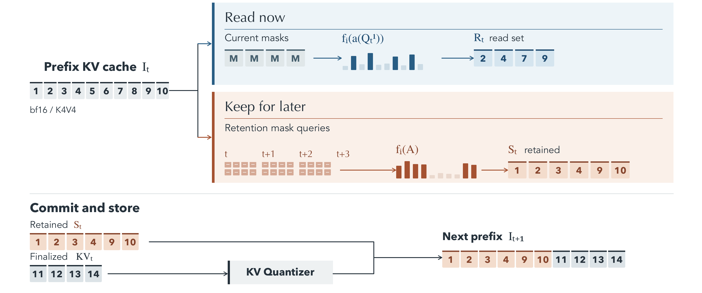

# MaskAhead

MaskAhead reduces the KV cache used by block diffusion language models. It uses queries from the current masked block to choose cache entries for attention, then probes upcoming blocks to decide which entries to keep. This repository contains the `maskahead` Python package and small tests for Fast-dLLM v2 7B and DreamReasoner-8B. Model weights are not included.

## How it works



- **Read now:** Mask queries from the current block select a temporary set of prefix KV entries for its remaining denoising steps.
- **Keep for later:** Mask queries from the current and upcoming blocks rank entries to retain in the persistent cache. The finalized block then adds its KV to form the next prefix.

## Install

Use Python 3.10–3.12 and install a CUDA-enabled PyTorch build for your accelerator first. Fast-dLLM and Dream need separate environments because they use different Transformers versions. Run the following commands from the repository root:

```bash
python3.10 -m venv envs/fastdllm
# Install CUDA-enabled PyTorch in envs/fastdllm first.
envs/fastdllm/bin/pip install -r requirements/fastdllm.txt
envs/fastdllm/bin/pip install -e .

python3.10 -m venv envs/dream
# Install CUDA-enabled PyTorch in envs/dream first.
envs/dream/bin/pip install -r requirements/dream.txt
envs/dream/bin/pip install -e .
```

The scripts load `Efficient-Large-Model/Fast_dLLM_v2_7B` and `Dream-org/DreamReasoner-8B` by default. Set `FASTDLLM_MODEL` or `DREAM_MODEL` to a local checkpoint path to use a different copy. The first test run also downloads its benchmark examples.

## Check generation

These commands load a model and run two short MATH-500 examples and one long HotpotQA prompt with MaskAhead and dense attention. The test prints generated token counts and timings, checks that required metrics exist, and repeats MaskAhead once to check deterministic output. It is a functionality check, not a quality or speed benchmark.

```bash
envs/fastdllm/bin/python scripts/smoke_test.py --model fastdllm --configs ours dense
envs/dream/bin/python scripts/smoke_test.py --model dream --configs ours dense
```

A successful run ends with `3/3 passed`. Omit `--configs` to check every configuration in `configs/`.

## Run a few benchmark examples

```bash
envs/fastdllm/bin/python scripts/run_task.py --model fastdllm --config configs/ours.yaml --benchmark math500 --limit 10
envs/dream/bin/python scripts/run_task.py --model dream --config configs/ours.yaml --benchmark math500 --limit 10
```

Each command writes predictions to `results/<model>/math500/ours.jsonl`, with the resolved configuration and environment information beside it. Replace `configs/ours.yaml` with `configs/dense.yaml` for dense attention or `configs/ours_k4v4.yaml` for four-bit keys and values.

CPU checks are available with `envs/fastdllm/bin/python -m unittest discover -s tests` and run automatically in GitHub Actions.

The code is released under the Apache License 2.0; see `LICENSE`.
